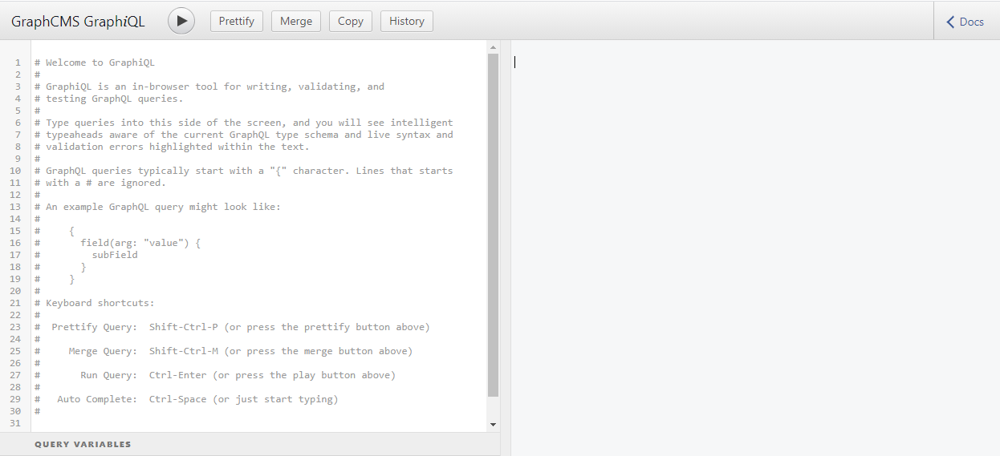
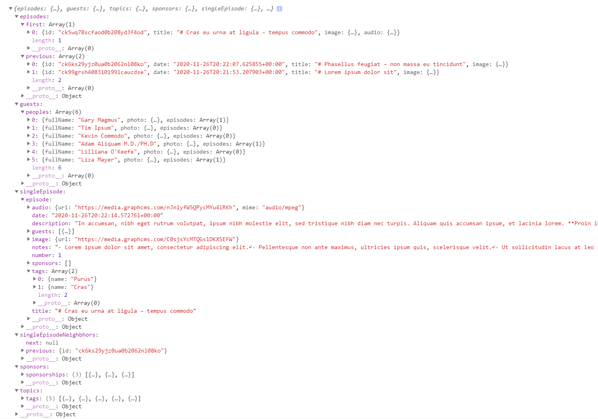

<!-- omit in toc -->
# GraphQL Project: Part 1

In this project, we will create a website that fetches data from a [GraphQL](https://graphql.org) endpoint that exposes data related to an imagined podcast called *GraphQL FM.*.


You can take a look at the final project in its entirety at [https://repl.it/@ritza/GraphQL-FM](https://repl.it/@ritza/GraphQL-FM). You can also view it as a standalone page by pressing the `Open in a new tab` button (at the top right of the former link) or by going straight to [https://graphql-fm.ritza.repl.co](https://graphql-fm.ritza.repl.co/).

We will create the above example in two separate steps. Part 1, which you are looking at now, will cover the basics of GraphQL and setting up our API. Whereas, [Part 2](./graphql-project-part-2) will show how we can turn the data from the GraphQL API into a fully functional website. We will start with the following:

- [Creating Your Own Project on Repl.it](#creating-your-own-project-on-replit)
- [Core Concepts](#core-concepts)
  - [What is GraphQL?](#what-is-graphql)
  - [GraphQL as an alternative to REST](#graphql-as-an-alternative-to-rest)
  - ["Hello World" in GraphQL](#hello-world-in-graphql)
  - [Using a GraphQL Explorer](#using-a-graphql-explorer)
  - [Adding GraphQL to JavaScript](#adding-graphql-to-javascript)
- [Creating an API](#creating-an-api)
  - [GraphQL as Service](#graphql-as-service)
  - [Custom GraphQL Function](#custom-graphql-function)
  - [Loading the Data](#loading-the-data)


## Creating Your Own Project on Repl.it

If you haven't already, head to the [signup page](https://repl.it/signup) and create a Repl.it account. Once created, set up a new project by:

1. Clicking on the `+ New repl` button.
2. Choosing the "HTML, CSS, JS" language. 
3. Giving your repl a name: In our case "graphql-fm".
4. Clicking the `Create repl` button.


Because we selected "HTML, CSS, JS" as our repl language, Repl.it has created the basic files needed for our front-end project, which should be:

- `index.html`
- `style.css`
- `script.js`

## Core Concepts


[Artsy](https://www.artsy.net) Engineering Lead, [Alan Johnson](http://artsy.github.io/author/alan) once proclaimed that [‘I have seen the future, and it looks a lot like GraphQL](http://artsy.github.io/blog/2018/05/08/is-graphql-the-future)’. Whether you agree with him or not, one thing is clear: the sheer boldness of the statement itself is indicative of the meteoric rise in popularity experienced by GraphQL over the last couple of years. 

Yet, despite it's surging popularity, you might have heard about it, but not really understand what exactly GraphQL entails. Alternatively, this might even be the first time that you even hear about GraphQL. Regardless, the following two-part guide should introduce you to GraphQL as a concept and illustrate how we can use GraphQL in native JavaScript code without requiring any additional libraries or frameworks. This means that even if you are already familiar with GraphQL, but have only experienced it by means of libraries like [Apollo](https://www.apollographql.com) or [Relay](https://relay.dev), then you will find value by learning how to make use of GraphQL by means of the native JavaScript [Fetch API](https://developer.mozilla.org/en-US/docs/Web/API/Fetch_API).

### What is GraphQL?

Given that Alan Johnson believes the future "looks a lot like GraphQL", how would he define GraphQL?

> *“I have seen the future, and it looks a lot like GraphQL. Mark my words: in 5 years, newly minted full-stack app developers won’t be debating RESTfulness anymore, because REST API design will be obsolete. […] It lets you model the resources and processes provided by a server as a domain-specific language (DSL). Clients can use it to send scripts written in your DSL to the server to process and respond to as a batch.”*
>
>— [Alan Johnson](https://artsy.github.io/author/alan/): [*Is GraphQL The Future?*](http://artsy.github.io/blog/2018/05/08/is-graphql-the-future/)

Yikes! That probably wasn’t the explanation you were looking for! Yet, by diving into some of the keywords mentioned above we will be able to create a clear, concise summary of GraphQL.

Let's start by unpacking the concept of a "[domain-specific language](https://en.wikipedia.org/wiki/Domain-specific_language)" (DSL). A DSL is a programming language created to express a very specific and narrow type of digital information (a domain). Whereas a [general-purpose language](https://en.wikipedia.org/wiki/General-purpose_programming_language) like [JavaScript](https://en.wikipedia.org/wiki/JavaScript) can (similar to a [Swiss army knife](https://en.wikipedia.org/wiki/Swiss_Army_knife)) be used to express a wide range of digital information. This includes everything from low-level data structures like [objects](https://developer.mozilla.org/en-US/docs/Web/JavaScript/Reference/Global_Objects/Object), [functions](https://developer.mozilla.org/en-US/docs/Web/JavaScript/Guide/Functions), [strings](https://developer.mozilla.org/en-US/docs/Web/JavaScript/Reference/Global_Objects/String), [symbols](https://developer.mozilla.org/en-US/docs/Web/JavaScript/Reference/Global_Objects/Symbol) to broader patterns like [HTTP requests](https://en.wikipedia.org/wiki/Hypertext_Transfer_Protocol), [DOM manipulations](https://en.wikipedia.org/wiki/Document_Object_Model) and/or [online data storage](https://en.wikipedia.org/wiki/Web_storage)). Domain-specific languages tend to be more limited (and intentionally so) in what they are able to express when compared to general-purpose languages. However, it is precisely because of their narrow scope that DSL’s are able to be much more expressive (in other words, easy to read and write) compared to general-purpose languages.

However, because of this limited scope DSL’s are often embedded inside other languages, in order to piggyback on the larger functionality provided by general-purpose languages. However, this does not mean that DSL’s are tied to specific languages. For example, [SQL](https://en.wikipedia.org/wiki/SQL) (Structured Query Language) is another domain-specific language that is used to query database structures like [MySQL](https://www.mysql.com) or [Postgres](https://www.postgresql.org). Yet, SQL has the same exact syntax whether used in JavaScript, [Python](https://en.wikipedia.org/wiki/Python_(programming_language)) or [PHP](https://en.wikipedia.org/wiki/PHP) (amongst others).

As an example, in JavaScript (via [Node](https://en.wikipedia.org/wiki/Node.js)) you might do the following:

```js
const { createConnection } = require('mysql');

const connection = createConnection({
  host: "localhost",
  user: "yourusername",
  password: "yourpassword",
  database: "mydb"
});

connection.query("SELECT * FROM customers");
```

Whereas in Python, you might do the latter:

```python
import mysql.connector

db = mysql.connector.connect(
  host="localhost",
  user="yourusername",
  password="yourpassword",
  database="mydatabase"
)

db.cursor().execute("SELECT * FROM customers")
```

You will note that the SQL expression (`SELECT * FROM customers`) is the exact same regardless of the environment. Similarly, GraphQL allows us to express specific data queries independently of how (or where) we use them.

### GraphQL as an alternative to REST

GraphQL can be used to express almost any type of data request. As an example, the immensely popular [Gatsby React framework](https://www.gatsbyjs.com) uses GraphQL to query [frontmatter](https://jekyllrb.com/docs/front-matter) and [plain text](https://en.wikipedia.org/wiki/Plain_text) in [Markdown](https://en.wikipedia.org/wiki/Markdown) files. Yet, in the majority of cases, GraphQL is used as an alternative to [REST](https://en.wikipedia.org/wiki/Representational_state_transfer) (Representational State Transfer).

For a long time REST was considered the de-facto standard for sending data between a browser and a server. Its popularity stems from the wide range of standardised operations it allows. These range from receiving data ([GET](https://developer.mozilla.org/en-US/docs/Web/HTTP/Methods/GET)), sending data ([POST](https://developer.mozilla.org/en-US/docs/Web/HTTP/Methods/POST)), merging two data structures ([PATCH](https://developer.mozilla.org/en-US/docs/Web/HTTP/Methods/PATCH)) or even removing data ([DELETE](https://developer.mozilla.org/en-US/docs/Web/HTTP/Methods/DELETE)). However, the primary drawback of REST is that it relies on the creation of fixed data endpoints. This means that a single request is only scoped to a specific, pre-defined set of data. [Chimezie Enyinnaya](https://blog.pusher.com/author/mezie/), a Nigerian content creator for [Pusher](https://pusher.com) (a service that manages remote [pub/sub](https://en.wikipedia.org/wiki/Publish%E2%80%93subscribe_pattern) messaging), explains it as follows:

> “With REST, we might have a `/authors/:id` endpoint to fetch an author, then another `/authors/:id/posts` endpoint to fetch the post of that particular author. Lastly, we could have a `/authors/:id/posts/:id/comments` endpoint that fetches the comments on the posts. […] It is easy to fetch more than the data you need with REST, because each endpoint in a REST API has a fixed data structure which it is meant to return whenever it is hit.”
>
>— [Chimezie Enyinnaya](https://blog.pusher.com/author/mezie/)*: [REST versus GraphQL](https://blog.pusher.com/rest-versus-graphql/)*

GraphQL was specifically conceived as a solution to this problem. It was originally created in 2012 for internal usage at [Facebook](https://www.facebook.com). The goal was to provide a standardized syntax to write more expressive (and powerful) data queries within the Facebook mobile app when fetching remote data. In fact, the above concerns were such a common pain-point that two alternatives to GraphQL were developed in parallel respectively by [Coursera](https://www.coursera.org/) and [Netflix](https://www.netflix.com/). Both Facebook and Netlfix eventually open-sourced their solutions. However, [Falcor](https://netflix.github.io/falcor) (the Netflix alternative) quickly lost ground to the immensely popular GraphQL.

### "Hello World" in GraphQL

So where does one start with GraphQL?

Fortunately, there are several GraphQL libraries that provide useful abstractions when working with GraphQL. The most popular (as previously mentioned) are Apollo and Relay. While these provide a lot of helpful features, like [cache management](https://www.apollographql.com/docs/react/caching/cache-configuration/) and [normalization](https://www.apollographql.com/blog/demystifying-cache-normalization). I often find that they are somewhat overwhelming to someone just starting with GraphQL. They also tend to be quite large and opinionated - meaning that they might be overkill for smaller, more flexible projects. Yet, a large number of developers don't even realise that you are able to use GraphQL without them!

It is important to remember that GrahpQL is merely an open standard (similar to HTML). It, by nature of simply being a DSL, is not locked to any specific tool, libraries or platform. The implication being that we should be able to use GraphQL with the [native JavaScript fetch API](https://developer.mozilla.org/en-US/docs/Web/API/Fetch_API), or even with popular, light-weight [AJAX](https://en.wikipedia.org/wiki/Ajax_(programming)) libraries like [Axios](https://www.npmjs.com/package/axios) (if you prefer the latter). In the example below, we will establish what the '[Hello World](https://en.wikipedia.org/wiki/%22Hello,_World!%22_program)' equivalent of GraphQL in JavaScript would be. In other words:

> "Such a program is very simple in most programming languages, and is often used to illustrate the basic syntax of a programming language"
>
>— Wikipedia: *["Hello, World!" program](https://en.wikipedia.org/wiki/%22Hello,_World!%22_program)*

### Using a GraphQL Explorer

Most GraphQL endpoints come with some form of GraphQL explorer. The most popular being [GraphiQL](https://github.com/graphql/graphiql) and [GraphQL Playground](https://github.com/graphql/graphql-playground). Yet, a couple of big tech products expose their GraphQL endpoints through custom-built, bespoke explorers. Notable examples are the [Facebook Graph API Explorer](https://developers.facebook.com/tools/explorer/) and [Github GraphQL API Explorer](https://docs.github.com/en/graphql/overview/explorer). However, in the majority of cases, you will be using either GraphiQL or GraphQL Playground.

As an example, let's start with a public GraphQL endpoint provided by the event management platform [Universe.com](https://www.universe.com/graphiql). Their endpoint allows developers to retrieve data associated with specific events in their database. We can use the explorer to create and test a super basic query.

If you go to [https://universe.com/graphiql](https://universe.com/graphiql) you should see the following:


The left-hand pane allows you to test specific queries, whereas the middle pane shows the query response once run, and lastly, the right-hand pane is the documentation describing the data structures that can be queried from this endpoint (if it is hidden click on the top-right button that says "*< Docs*"). The play button (the sideways triangle in the upper-left) executes the current query in the left-hand pane, whereas "Prettify" forces a best-practice layout for your query, and finally "History" merely allows you to see previous queries you used.

We can run the default starting query (at the time of writing) and we'll get a [JSON](https://en.wikipedia.org/wiki/JSON)-like response that looks something like this:

```json
{
  "data": {
    "event": {
      "title": "End of Unix Time",
      "address": "Los Angeles, CA, USA",
      "currency": "USD",
      "host": {
        "firstName": "Joshua"
      },
      "timeSlots": {
        "totalCount": 2,
        "nodes": [
          {
            "startAt": "2018-08-31T12:00:00"
          },
          {
            "startAt": "2038-01-18T21:00:00"
          }
        ]
      }
    }
  }
}
```

This is great! But you might not have any idea what just happened. To this end, let us clear the left-hand pane and recreate the query step by step. This will allow me to explain the underlying logic as we go.

We can start by adding `query {}`. This indicates to the endpoint that we want to retrieve data from the server. Note that `mutation {}` allows us to actually send data to the endpoint and `subscription {}` allows us to listen for changes in the data. However for the scope of this guide we will not be covering either of these - however, you can learn more [on the GraphQL website itself](https://graphql.org/learn/queries/).

If we place our cursors within the curly brackets and press the spacebar and enter keys at the same time we should get a list of recommended queries (based on the structure of the data) as follows:


As per the initial example let us reselect `event`. This means that we want to retrieve information associate with a specific event. The specific event we are interested in has a unique ID of `5879ad8f6672e70036d58ba5` (at the time of writing). We can pass this ID as an argument to the query (similar to how we would with JavaScript functions) as follows: `event(id: "5879ad8f6672e70036d58ba5") {}` .

Now that we've identified the event that we want to query we can instruct GraphQL to only retrieve the information that we're interested in. This prevents the response from returning the entire event data-structure (called [over-fetching](https://stackoverflow.com/questions/44564905/what-is-over-fetching-or-under-fetching) in REST). In order to illustrate the dynamic nature of GraphQL, we will be asking for completely different data than was covered in the initial example. This means that our query will now look something like this:

```graphql
query {
  event(id: "5879ad8f6672e70036d58ba5") {
    active
    address
    url
  }
}
```

However, if you were attentive you would have noticed that the initial example had nested queries. This is where the distinction between GraphQL and REST becomes central. Everything we've done up until this point very much adheres to the way we would think about REST (apart from [over-fetching and under-fetching](https://stackoverflow.com/questions/44564905/what-is-over-fetching-or-under-fetching)). REST function similar to a traditional JavaScript function, wheres we provide input values and we get a specific, pre-determined output. GraphQL works a bit differently. 

It can be said that GraphQL queries are little maps in the form of strings used to navigate and find all requested data in a single journey. This means that we can (for the fun of it) conceptualise a set of real-world instructions within the GraphQL syntax:

```jsx
instructions {
  travel(type: "drive") {
    mall {
      travel(type: "walk") {
        general_store {
          food_isle {
            bread
            peanut_butter
          }
          stationary_isle {
            pens (amount: 12)
            paper
          }
        }
        hardware_store {
          nails
          hammer
        }
      }
    }
    post_office {
      packages
      mail
    }
  }
}
```

I’m calling it — 2038 robot servants will be programmed with GraphQL!

Since GraphQL is a [graph-like structure](https://en.wikipedia.org/wiki/Graph_(abstract_data_type)) (as per the name), we can get information related to a specific event without creating a completely new request. This is where GraphQL really shines when compared to REST! You can think of these as roads or pathways connecting different places. In other words, if you are in the mall (as per our example above), you can go directly to the `general_store_store` in that `mall` and then to the `hardware_store` afterwards. Furthermore, because the `mall` is connected to the `post_office` by a road you can then drive to the `post_office` afterwards.

Due to the map-like nature of queries, we can actually have the query goes in a complete circle ending up exactly where it started (although there is no real practical reason for this, it is fun nonetheless):

```graphql
{
  event(id: "5879ad8f6672e70036d58ba5") {
    active
    address
    url

    timeSlots {
      totalCount

      nodes {
				id
        startAt
				endAt

				event {
					id
			    active
			    address
			    url
			  }
    }
  }
}
```

### Adding GraphQL to JavaScript

Let's take the above query built within the GraphiQL explorer and place it in a JavaScript snippet. This allows us to request the above data directly from our browser. Note that the following example assumes familiarity with the native JavaScript [Fetch API](https://developer.mozilla.org/en-US/docs/Web/API/Fetch_API):

*Note that if this is the first time you are encountering I recommend that you give the phenomenal [How to Use the JavaScript Fetch API to Get Data](https://www.digitalocean.com/community/tutorials/how-to-use-the-javascript-fetch-api-to-get-data) by the [Digital Ocean team](https://www.digitalocean.com/).*

```jsx
const QUERY = `
	query {
	  event(id: "5879ad8f6672e70036d58ba5") {
	    title
	    address
	    currency
	    host {
	      firstName
	    }
	    timeSlots {
	      totalCount
	      nodes {
	        startAt
	      }
	    }
	  }
	}
`

const FETCH_OPTIONS =   {
  method: 'POST',
  body: JSON.stringify({ query: QUERY }),
}

fetch('[https://universe.com/graphiql](https://universe.com/graphiql)', FETCH_OPTIONS )
	.then(response => response.json())
	.then(console.log)
```

The above example should return something along the following lines:

```jsx
{
  "data": {
    "event": {
      "title": "End of Unix Time",
      "address": "Los Angeles, CA, USA",
      "currency": "USD",
      "host": {
        "firstName": "Joshua"
      },
      "timeSlots": {
        "totalCount": 2,
        "nodes": [
          {
            "startAt": "2018-08-31T12:00:00"
          },
          {
            "startAt": "2038-01-18T21:00:00"
          }
        ]
      }
    }
  }
}
```

## Creating an API


Great, we've mastered the basics of GraphQL!

However, we probably want to create our own endpoint, since being bound exclusively to data from [Universe.com](http://universe.com) won't be that helpful in our own project. There are several ready-to-go GraphQL endpoint frameworks that you we deploy to a server or cloud hosting. Some extremely popular examples are [express-graphql](https://www.npmjs.com/package/express-graphql) for Node (running [Express](https://expressjs.com/)) and [Graphene](https://graphene-python.org/) for Python servers. Alternatively, there are several all-in-one solutions like [Prisma](https://www.prisma.io/) or [Hasura](https://hasura.io/) that come with a database already baked in.

### GraphQL as Service

However, for the sake of simplicity, we will be using a free [software as a service](https://en.wikipedia.org/wiki/Software_as_a_service) (SaaS) platform called [GraphCMS](https://graphcms.com/). This allows us to get a custom GraphQL endpoint up and running with extreme ease.

In order to follow along, you can visit [https://graphcms.com](https://graphcms.com/) and sign up for a free account. Once your account has been created you can create a new sample project by selecting the "Podcast Starter". Make sure that "Include template content" is selected since this will populate our API with placeholder information. You are welcome to add or edit content to the API by means of the GraphCMS project dashboard, however, please make sure that you don't change the schema since we will be relying on it to write our queries.

Once your project has been created you can select the "Settings" tab at the bottom, and navigate to "API Access". Make sure to copy the endpoint URL (at the top of the page) and save it somewhere where you will be able to access it later. We'll be directing all our GraphQL queries to this URL, so it is useful to have it at hand all the time.

If you are struggling you can have a look at the following animated demo:


Note that your API endpoint should look something like the following: `[https://api-us-east-1.graphcms.com/v2/ckll20qnadfe101xr8m2a7m2h/master](https://api-us-east-1.graphcms.com/v2/ckll20qnkffe101xr8m2a7m2h/master)`. However, in the following code snippets, I will be using `<<<YOUR ENDPOINT HERE>>>` to prevent you from accidentally using an example endpoint if you are following along.

Furthermore, you will also note that if you navigate straight to your endpoint within your browser you will be presented with a GraphiQL Explorer that allows you to test and try out queries for your specific endpoint:



### Custom GraphQL Function

We will be making several GraphQL queries from our website. To this end, it is helpful to create a basic abstraction (by means of a JavaScript function) that handles these requests for us in order to reduce boilerplate code. We can convert our JavaScript example above into a basic GraphQL function as follows:

```jsx
const gqlQuery = async (query) => {
  const response = await fetch(
    '<<<YOUR ENDPOINT HERE>>>',
    {
      method: 'POST',
      body: JSON.stringify({ query });
    }
  )
  
  if (!response || !response.ok) {
    throw new Error('Query failed');
  }
  
  return await response.json().data;
}
```

This allows us to pass a query to the function, which in return provides a response once the query resolves. It is also worth noting that we are including a check in the function to determine whether the response succeeded (by checking if it returned a `200` status, by means of `response.ok` ).

This means that we should be able to do the following:

```jsx
const QUERY = `
	query {
	  episodes {
	    title
		}
	}
`

gqlQuery(QUERY).then(console.log)
```

However, the above will always return all the episodes from our database. Yet, if we only want to show the two most recent episodes we can do the following in our query:

```graphql
query {
  episodes(first: 2) {
    title
	}
}
```

However, this isn't very flexible, since it means that we'll need to create an entirely new query when we want to only get the first or first-three episodes. Luckily, GraphQL allows us to designate and pass variables to be used by the query.

For example, if we have a look in our GraphiQL explorer we can do the following (you might need to click on "QUERY VARIABLES" in the bottom-left corner to open it up:


You'll see that we can pass variables as a JSON object, and then within the query we can specify the variables these variables in brackets `( )` after the `query` command. Note that variable names should always start with a dollar sign (`$`). In our case we can specify that we are expecting `$count` and that it will be an `Int` value. An `Int` is essentially just a whole number that doesn't have a decimal. 

We then pass the value of `$count` directly to `episodes(first: $count)` . In order to replicate this within our JavaScript we can simply add variables to our body as follows:

```jsx
const gqlQuery = async (query, variables) => {
  const response = await fetch(
    'https://api-us-east-1.graphcms.com/v2/ckll20qnkffe101xr8m2a7m2h/master',
    {
      method: 'POST',
      body: JSON.stringify({ query, variables });
    }
  )
  
  if (!response || !response.ok) {
    throw new Error('Query failed');
  }
  
  return await response.json().data;
}
```

This means that we'll be able to do the following (which will respectively log the first, first-two and first-three episodes to the console):

```jsx
const QUERY = `
	query ($count: Int) {
	  episodes(first: $count) {
	    title
		}
	}
`

gqlQuery(QUERY, { count: 1 }).then(console.log)
gqlQuery(QUERY, { count: 2 }).then(console.log)
gqlQuery(QUERY, { count: 3 }).then(console.log)

```

Now with our endpoint set up we probably need to start mapping out all the information we will be needing on each page. This can be done in any manner, include a hand-drawn node, however I like to just do this in markdown as follows:

```markdown
# GraphQL FM Website

## Episodes Page (Default Landing Page)

- The First Episode (for hero banner)
	- Unique ID (This will be used as the URL when viewing the episode)
	- Episode Name
  - Cover Image URL
  - Audio
		- File URL
    - File type (for example `.mp3`, `.wav`, etc.)

- Previous Episodes (all episodes after the first one)
	- Unique ID (This will be used as the URL when viewing the episode)
	- Published date
  - Episode Name
	- Cover Image URL

## Single Episode Page
	
- Previous Episode ID (if applicable)
- Next Episode ID (if applicable)

- Current Episode
	- Episode Number
  - Published Date
  - Episode Name
	- Cover Image URL
  - Show Notes
	- List of topics associated with episode
  - Audio
		- File URL
    - File type (for example `.mp3`, `.wav`, etc.)
  - List of Guests
		- Name of each guest
    - Photo URL of each guest
  - List of episode sponsors
		- Name of sponsoring  company
		- Website URL of sponsoring company

## Guests Page

- List of guests
	- Name of each guest
  - Photo URL of each guest
  - List of episodes that appeared on
		- Unique ID (This will be used as the URL when viewing the episode)
		- Date that each episode was published
    - Episode Name for each episode
		- Cover Image URL for each episode

## Topics Page

  - A list of all topics
    - The name of each topic
    - All episodes associated with a specific topic
      - Unique ID if the episode (This will be used as the URL when viewing the episode)
      - The date that each episode was published at
      - The name of each episode
      - The cover image URL of each episode

## Resources Page

  - A list of all resources
    - The filename of each individual resource
    - The file type (for example `.mp3`, `.wav`, etc.) of each resource
    - The URL where each individual resource can be downloaded

## Sponsors Page

  - A list of all sponsors
    - The company name associated with each sponsorship
    - All the episodes that a specific company is sponsoring
      - Unique ID if the episode (This will be used as the URL when viewing the episode)
      - The date that each episode was published at
      - The name of each episode
      - The cover image URL of each episode
```

### Loading the Data

While creating our information architecture one thing should have become apparent: there are some specific data co-configurations that are called on several different pages. Luckily, the GraphQL standardization allows for something called [Fragments](https://graphql.org/learn/queries/#fragments) that helps us keep our queries DRY (an programming acronym for [Don't Repeat Yourself](https://en.wikipedia.org/wiki/Don%27t_repeat_yourself)). The most common structure that seems to be popping up commonly in our information architecture is the data required to show a preview of a specific episode. We can wrap this in GraphQL query as follow (very similar to how we would create a query itself in JavaScript):

```js
  const EPISODE_PREVIEW_FRAGMENT = `
    fragment EpisodePreview on Episode {
        id
        date: publishedAt
        title
        image {
          url
        }
    }
  `
```

We can then use it in a specific query as follows (by using [string interpolation](https://developer.mozilla.org/en-US/docs/Web/JavaScript/Reference/Template_literals#expression_interpolation)):

```js
const GUESTS_PAGE_QUERY = `
  query {
   peoples {
    fullName
    photo {
      url
    }
    episodes: appearedOn {
      ...EpisodePreview
    }
  }
 }

  ${EPISODE_PREVIEW_FRAGMENT}
```

It is common practice to place fragments after the query expression instead of before. Using the above information architecture and our declared fragment we can convert fetch all the data required in our information architecture by modify our JavaScript file so that end up with the following:

```js
const EPISODE_PREVIEW_FRAGMENT = `
  fragment EpisodePreview on Episode {
      id
      date: publishedAt
      title
      image {
        url
      }
  }
`

const EPISODES_PAGE_QUERY = `
	query {
    first: episodes(first: 1) {
      id
      title
      image {
        url
      }
      audio: audioFile {
        url
        mime: mimeType
      }
    }

    previous: episodes(skip: 1) {
      ...EpisodePreview,
    }
  }
  
  ${EPISODE_PREVIEW_FRAGMENT}
`;

const SINGLE_EPISODE_PAGE_QUERY = `
	query($id: ID) {
    episode(where: { id: $id }) {
      number: episodeNumber
      date: publishedAt
      title
      description
      notes: showNotes
      audio: audioFile {
        url
        mime: mimeType
      }
      image {
        url
      }
      guests {
        fullName
        photo {
          url
        }
      }
      tags {
        name
      }
      sponsors {
        company {
          name
          website
        }
      }
    }
  }
`;

const SINGLE_EPISODE_NEIGHBORS_QUERY = `
	query($previous: Int, $next: Int) {
    previous: episode(where: { episodeNumber: $previous }) { id }
    next: episode(where: { episodeNumber: $next }) { id }
  }
`;

const GUESTS_PAGE_QUERY = `
  query {
   peoples {
    fullName
    photo {
      url
    }
    episodes: appearedOn {
      ...EpisodePreview
    }
  }
 }
 
 ${EPISODE_PREVIEW_FRAGMENT}
`;

const TOPICS_PAGE_QUERY = `
	query {
    tags {
      name
      episodes {
        ...EpisodePreview
      }
    }
  }
  
  ${EPISODE_PREVIEW_FRAGMENT}
`;

const RESOURCES_PAGE_QUERY = `
	query {
     assets {
      fileName
      mimeType
      url
    }
  }
  
  ${EPISODE_PREVIEW_FRAGMENT}
`;

const SPONSORS_PAGE_QUERY = `
	query {
    sponsorships {
      company {
        name
      }
      episodes {
        ...EpisodePreview
      }
    }
  }
  
  ${EPISODE_PREVIEW_FRAGMENT}
`;

const gqlQuery = async (query, variables) => {
  const response = await fetch(
    "https://api-us-east-1.graphcms.com/v2/ckll20qnkffe101xr8m2a7m2h/master",
    {
      method: "POST",
      body: JSON.stringify({ query, variables })
    }
  );

  if (!response || !response.ok) {
    throw new Error("Query failed");
  }

  const { data } = await response.json()
  return data;
};

const getData = async () => {
  const episodes = await gqlQuery(EPISODES_PAGE_QUERY);
  const guests = await gqlQuery(GUESTS_PAGE_QUERY);
  const topics = await gqlQuery(TOPICS_PAGE_QUERY)
  const sponsors = await gqlQuery(SPONSORS_PAGE_QUERY)
  
  const [{ id }] = episodes.first;
  const singleEpisode = await gqlQuery(SINGLE_EPISODE_PAGE_QUERY, { id });

  const { number } = singleEpisode.episode;

  const singleEpisodeNeighbhors = await gqlQuery(
    SINGLE_EPISODE_NEIGHBORS_QUERY,
    { previous: number + 1, next: number - 1 }
  )

  console.log({
    episodes,
    guests,
    topics,
    sponsors,
    singleEpisode,
    singleEpisodeNeighbhors,
  });
};

getData();
```

Upon running the above you should get one big object in your browser console that contains all the data that we'll be using in our website:



However, merely having the data in not enough, we need to do so additional work structure it in a presentable way for users visiting our website. If you are interested in how we take the above and turn it into a the fully functional example shown at the beginning of this guide then you can proceed directly to [part 2](./graphql-project-part-2).